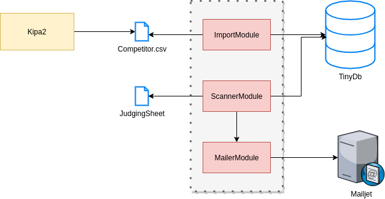

# DressageJudgingSheetToCompetitor

This application is aimed help dressage competition organizers to shere Jugding sheet papers to competitors. 

How this should work.

1. Before Import your competitors from Kipa to this application. Kipa have export feature and export contais competitor and competitor email address.
1. In competition you got judging sheets from judge(s) and secretary.
2. Enter results to the Equipe
3. Scan jugding sheet paper
4. Application tries recognize competitor name from sheets and suggest it to you.
5. You accept competitor or select another on, and application send it to competitor via email.

## Design



## Running dev 

To run this application, follow these steps:

1. Make sure you have the necessary dependencies installed. You can check the `requirements.txt` file for a list of required packages.

2. Clone the repository to your local machine:
    ```
    git clone https://github.com/your-username/DressgeJudgingSheetsToCompetitor.git
    ```

3. Navigate to the project directory:
    ```
    cd DressgeJudgingSheetsToCompetitor
    ```

4. Set up the virtual environment:
    ```
    python -m venv venv
    ```

5. Activate the virtual environment:
    - For Windows:
      ```
      venv\Scripts\activate
      ```
    - For macOS/Linux:
      ```
      source venv/bin/activate
      ```

6. Install the required dependencies:
    ```
    pip install -r requirements.txt
    ```

7. Run the application:
    ```
    python importTool.py
    ```

8. Access the application in your web browser by navigating to `http://localhost:5000`.


